# Pristine Reverse Proxy - Architecture Design Document

## System Overview

The Pristine Reverse Proxy is a high-performance, asynchronous reverse proxy built with C++ and Boost.Asio. This document provides comprehensive architectural diagrams and design patterns used in the system.

## 1. System Architecture Diagram

## 2. Class Diagram

## 3. Sequence Diagram - HTTP Request Flow

## 4. Sequence Diagram - HTTPS with Certificate Management

## 5. State Diagram - Connection Lifecycle

## 6. Component Diagram

## 7. Data Flow Diagram

## 8. Deployment Diagram

## 9. CRC (Class-Responsibility-Collaboration) Cards

### ReverseProxy
**Responsibilities:**
- Manage HTTP/HTTPS server lifecycle
- Coordinate all system components
- Handle incoming connections
- Manage worker thread pool

**Collaborators:**
- ConfigManager (configuration)
- RequestRouter (routing decisions)
- CertificateManager (SSL contexts)
- ConnectionHandler (request processing)

### RequestRouter
**Responsibilities:**
- Route requests based on Host header
- Maintain domain-to-backend mappings
- Validate routing rules
- Handle routing failures

**Collaborators:**
- ConfigManager (site configurations)
- ConnectionHandler (routing results)

### ConnectionHandler
**Responsibilities:**
- Handle individual client connections
- Parse HTTP requests and responses
- Forward requests to backends
- Manage connection lifecycle

**Collaborators:**
- RequestRouter (routing decisions)
- Http2Handler (HTTP/2 protocol)
- WebSocketHandler (WebSocket upgrades)
- LoadBalancer (backend selection)

### CertificateManager
**Responsibilities:**
- Generate and manage SSL certificates
- Handle Let's Encrypt ACME protocol
- Maintain SSL contexts per domain
- Certificate renewal and validation

**Collaborators:**
- ReverseProxy (SSL context provision)
- ConfigManager (certificate settings)

## 10. Performance Characteristics

```mermaid
graph LR
    subgraph "Performance Metrics"
        LATENCY[Latency: <1ms<br/>proxy overhead]
        THROUGHPUT[Throughput: 10K+ RPS<br/>per core]
        MEMORY[Memory: <50MB<br/>base footprint]
        CONNECTIONS[Concurrent: 10K+<br/>connections]
    end
    
    subgraph "Optimization Techniques"
        ASYNC[Async I/O<br/>Non-blocking]
        THREADS[Thread Pool<br/>CPU cores × 2]
        POOLING[Connection<br/>Pooling]
        ZERO_COPY[Zero-copy<br/>Forwarding]
    end
    
    ASYNC --> LATENCY
    THREADS --> THROUGHPUT
    POOLING --> MEMORY
    ZERO_COPY --> CONNECTIONS
```

This architectural design document provides a comprehensive view of the Pristine Reverse Proxy system, covering all major components, interactions, and design decisions. The diagrams use Mermaid syntax for easy rendering and maintenance.
